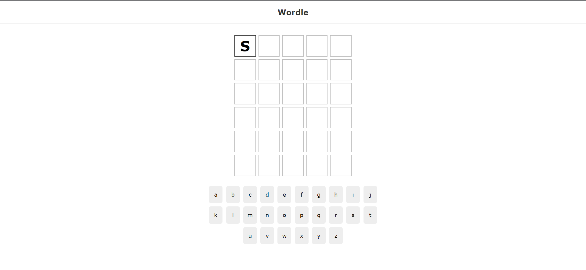
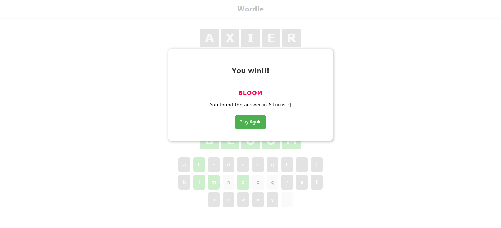
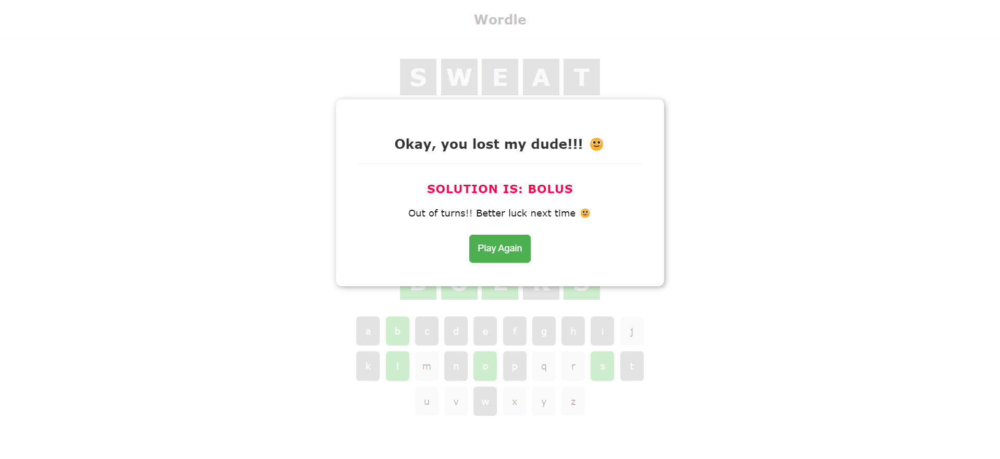

# React Wordle

Welcome to Wordle Master, a fun and addictive word-guessing game built using ReactJS and powered by custom hooks. Put your word skills to the test as you try to guess the hidden word with a limited number of attempts. Challenge your vocabulary, exercise your brain, and have a blast while playing Wordle Master!

## Features

- **Sleek and Intuitive Design:** Wordle Master features a clean and user-friendly interface that enhances your gaming experience.
- **Custom Hooks Power:** Built using the power of custom React hooks, the app offers efficient state management and component logic.
- **Wordle Gameplay:** Guess the secret five-letter word within six attempts. Each guess provides feedback on the correctness of the letters, making it a thrilling challenge.
- **Endless Replayability:** With a vast dictionary of words, every game is a unique experience, ensuring you'll never run out of words to guess.
- **Real-time Feedback:** Receive immediate feedback on your guesses, helping you fine-tune your next attempt.

## Screenshots




## Setup

Follow these steps to set up the project locally:

1. Clone the repository:
```bash
git clone https://github.com/Lux-27/React-Wordle.git
```

2. Navigate to the project directory:
```bash
cd React-Wordle
```
3. Install the dependencies:
```bash
npm install
```

## Usage

First, run the development server:

```bash
npm run start
```

Then, run the local JSON server:

```bash
json-server ./data/output.json --port 3001
```

Open [http://localhost:3000](http://localhost:3000) with your browser to see the web page.

Open [http://localhost:3001/solutions](http://localhost:3001/solutions) with your browser to see the solutions for the game.


This will start the development server and open the app in your default web browser.

## How to play
- Launch the app and begin a new game.

- Guess a five-letter word and submit your attempt.

- Receive feedback on the correctness of each letter in your guess.

- Use the feedback to make educated guesses and solve the word within six attempts.

- Enjoy the thrill of victory as you successfully guess the hidden word!

## Customization
Wordle Master is not only a fun game but also a versatile project. You can easily customize and expand upon it:
- Add difficulty levels with varying word lengths and guess limits.
- Implement a timer to add an extra layer of challenge.
- Integrate a multiplayer mode and compete with friends.
- Enhance the UI with additional animations and visual effects.

## Contributions
- Contributions are welcome and encouraged! If you find a bug or have an idea for improvement, feel free to open an issue or submit a pull request.

## Technologies Used

- ReactJS
- JavaScript
- Custom Hooks

Get ready to test your word skills and have hours of entertainment with Wordle Master! Try it out now and see if you can become the ultimate Wordle Master. Happy guessing!
